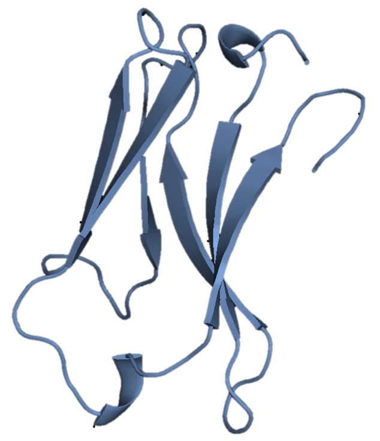

.. ANTIPASTI documentation master file, created by
   sphinx-quickstart on Fri Apr  28 15:55:22 2023.
   You can adapt this file completely to your liking, but it should at least
   contain the root `toctree` directive.

Welcome to ANTIPASTI's documentation!
=====================================

About
-----

ANTIPASTI (ANTIbodies - Predicting Affinity from STructural Information) is a Deep Learning model that predicts the binding affinity of antibodies from their sequence and three-dimensional structure. The `repository is on GitHub <https://github.com/kevinmicha/ANTIPASTI>`_.

You can follow the `example notebooks <https://github.com/kevinmicha/ANTIPASTI/tree/main/notebooks>`_ to learn how to use the core functionality of ANTIPASTI

If you have already read our :doc:`paper<citing>`, you might want to proceed with the :doc:`installation` or the :doc:`Tutorial <tutorial/index>`.

Contributing
------------

Feel free to read the :doc:`instructions<contributing>`. You can also contact the code author `Kevin Michalewicz <https://kevinmichalewicz.com>`_.

Contents
--------

.. toctree::
   :maxdepth: 2
   
   Installation<installation>
   Contributing<contributing>
   Tutorial<tutorial/index>
   Citing<citing>
   Related published work<publication>
   Autogenerated Full API<apidoc/antipasti>

Last build of this documentation: |today|.
